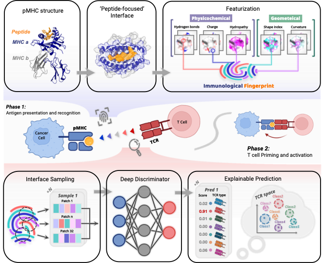

# TCR–pMHC Fingerprint Discrimination with Geometric Deep Learning

This project builds upon the [MaSIF](https://github.com/LPDI-EPFL/masif) framework and adapts its geometric deep learning pipeline to predict the TCR-binding preferences of pMHCs by leveraging immunological fingerprints learned from interfacial surface features.

## 🔍 Overview

- **Goal:** To identify T-cell receptor (TCR) recognition patterns toward peptide–MHC (pMHC) complexes.
- **Method:** Leverages geometric deep learning to extract and discriminate immunologically meaningful surface fingerprints that are predictive of TCR binding preferences.
- **Framework Base:** Built on top of MaSIF's surface featurization and neural network pipelines.

### 🔧 Key Modifications

- Adapted the surface featurization pipeline to focus on peptide-centric TCR recognition on pMHC interfaces ([`./source/data_preparation_pmhc/`](./source/data_preparation_pmhc/)).
- Developed a supervised learning framework using experimentally validated TCR–pMHC structures ([`./source/deep_discriminator/`](./source/deep_discriminator/)).
- Incorporated cross-validation and ensemble learning to improve discriminative reliability and interpretability ([`./source/trace_pmhc/`](./source/trace_pmhc/), [`./source/trace_peptide/`](./source/trace_peptide/)).
- Added visualization modules to render immunological fingerprints and recognition patterns using PyMOL ([`./source/masif_pymol_plugin_sc/`](./source/masif_pymol_plugin_sc/)).

---

